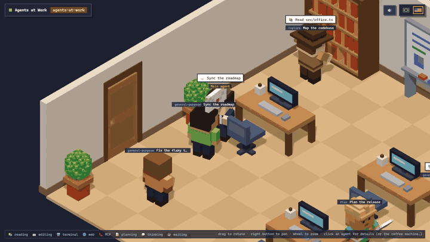

# Agents at Work

> **Beta.** A Claude Code plugin that shows your session as a voxel office in the browser: the main agent
> and every subagent walk to the bookshelf, the server rack or the whiteboard as they use tools, hand
> tasks and results to each other in envelopes — and spend way too long at the coffee machine.

[](docs/media/showcase.mp4)

▶️ **[Watch it with sound](docs/media/showcase.mp4)** (the sound effects are half the fun)

## What you see

| In the session                        | In the office                                                |
| ------------------------------------- | ------------------------------------------------------------ |
| `Read`, `Grep`, `Glob`…               | 📚 walks to the bookshelf                                    |
| `Edit`, `Write`                       | ⌨️ types at the desk                                         |
| `Bash`, `PowerShell`                  | 🖥️ operates the server rack                                  |
| `WebSearch`, `WebFetch`               | 🌐 spins the globe                                           |
| MCP tools                             | 📞 picks up the red phone                                    |
| `TodoWrite`, plan mode, long thinking | 📝 writes on the whiteboard                                  |
| A subagent is spawned                 | it walks in through the door and receives a sealed envelope  |
| A subagent finishes                   | it delivers a green (success) or crumpled (failure) envelope |
| Nothing happens for a while           | everyone naps and the lights dim                             |

### The coffee machine

Time at the coffee machine is **blocked time**:

- A terminal command running for more than 10 s: _"☕ npm run build… compiling"_.
- An agent waiting on its subagents for more than 3 s goes to _"☕ supervise"_ them from the coffee machine
  (and gets told _"🙄 found you at the coffee machine, boss"_ on delivery).
- If the command fails while the agent is on a break, it **spills its coffee** and runs back to its desk.
- Two agents on a break start gossiping. From the fifth cup on, they shake: _"☕×5 I FEEL GREAT"_.
- Click the coffee machine for the _Employee of the month (in reverse)_ ranking.

The page speaks **Português (Brasil)** and **English (US)** — switch with the flags in the top-right corner.

### Approve tools from the office

When Claude Code would ask permission for a tool call, the agent **raises its hand** in the office and
its panel shows **Allow / Deny**. Answer there, or wait 60 s and the usual terminal dialog appears. With
no office page open, nothing changes: the terminal asks right away. Questions (`AskUserQuestion`) and
plan approval stay in the terminal — Claude Code only lets plugins tighten those.

### Drive the agents from the office

Click an agent and use its panel the way you would use the terminal:

- **Main agent:** type a prompt and **Send** (Ctrl+Enter). It enters the session as if you had typed it;
  while the agent is busy it waits for the current turn to end.
- **Subagent:** send it a message. If it already finished, the message resumes it.
- **Stop** interrupts the agent's running turn.
- **+ New subagent** (in the main agent's panel) hires one with a description, a type and a task.

Only the page opened by `/office` can answer: the link carries a per-session secret key (removed from
the address bar on load). The server also refuses requests from other web sites, foreign host names
(DNS rebinding) and browsers on the routes reserved for the plugin.

## Install

Requirements: **Claude Code 2.1.29x or newer** (the plugin uses the early-access function hooks API) and
**Node.js 20+** on your `PATH` (the office server runs on Node). Nothing else: no `npm install` needed.

```sh
claude plugin marketplace add natansalvadorligabo/agents-at-work
claude plugin install agents-at-work@agents-at-work
```

Start a new session and run `/office`: the office opens in your browser. The plugin starts a small
server on `127.0.0.1:47821` that only listens on your machine.

To try a local clone instead: `claude --plugin-dir /path/to/agents-at-work`.

## Develop

```sh
npm install
npm test            # web + server tests (node --test) and hook tests (claude plugin test)
npm run check       # prettier + typecheck + tests
npm start           # run the office server alone
npm run demo:coffee # fake a 2-minute session against the running server (open the printed URL)
npm run demo:permission # raise a fake permission request and wait for Allow / Deny
npm run demo:showcase # everything at once: hires, every station, coffee, a raised hand, a desk punch
```

| Path       | What lives there                                                                   |
| ---------- | ---------------------------------------------------------------------------------- |
| `hooks/`   | The Claude Code hooks module (TypeScript): turns session events into office events |
| `shared/`  | The wire protocol shared by hooks, server and browser                              |
| `server/`  | Node server: event intake, session store, server-sent events, static files         |
| `web/src/` | The browser app (plain ES modules + JSDoc types, three.js r169 vendored)           |
| `test/`    | `node --test` suites and named fakes                                               |
| `tools/`   | Session simulators for demos                                                       |

All code is type-checked (`tsc --checkJs`, strict) and formatted with Prettier.
